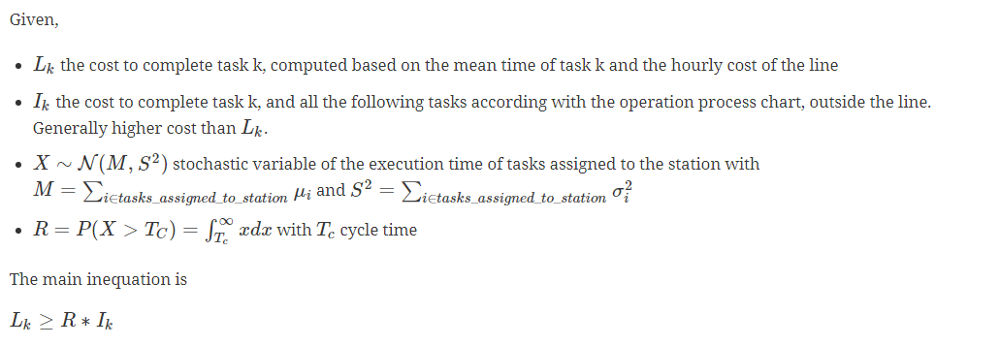
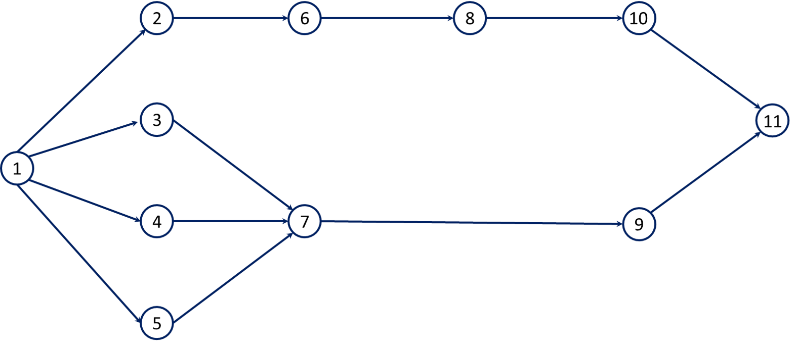

:stem:

= Kottas-Lau algorithm for paced production lines

A Python implementation of the Kottas-Lau algorithm for the paced production lines load balancing problem.

== Introduction

This method helps to design and balance a production line given a set of tasks and a target production rate.
The production rate of the line (i.e. the number of pieces produced in a time period, minute/hour) is limited by the slowest station:

* how many stations do we need?
* how to assign the tasks to them in order to guarantee the desired production rate at minimum cost and respecting the technological constrains?

The main idea behind this approach is to overcome the hypothesis that the *task execution time* is deterministic, but this duration is *modelled as a stochastic variable normally distributed with mean and variance*.

Considering the variability of execution time of a single task, is not enough to assert that the workload of a station (computed as the sum of the mean execution time of the assigned tasks) is lower of the cycle time (the inverse of the production rate).

Always *exist a probability (risk) of missed completion of the task* that causes the product to go outside the production line,  the uncompleted piece will be processed outside the line incurring into an higher cost.

The algorithm revolves around the question (to be answered for every task):

TIP: _“Does it worth to risk to not complete the task, and incur in higher costs outside the line, assigning it to an already filled station? Or the cost of opening a new station is higher than the potential out of completion cost of the pending task”_

When true, the task is considered “desiderable” so can be assigned to the station.

For further details, please refer to _John F. Kottas & Hon-Shiang Lau (1976) A Total Operating Cost Model for Paced Lines with Stochastic Task Times, A I I E Transactions, 8:2, 234-240_

== Data

* The expected production rate.
* The cost per hour of a station.
* The cost per task done outside the line.
* The list of tasks with mean and variance of the completion time.
* The technological constraints between tasks that imposes a successor-predecessor relationship.

.Example of operation process chart

